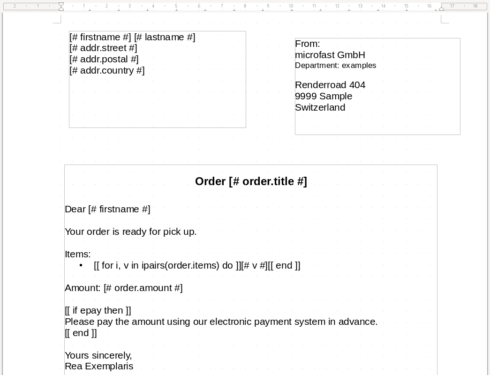
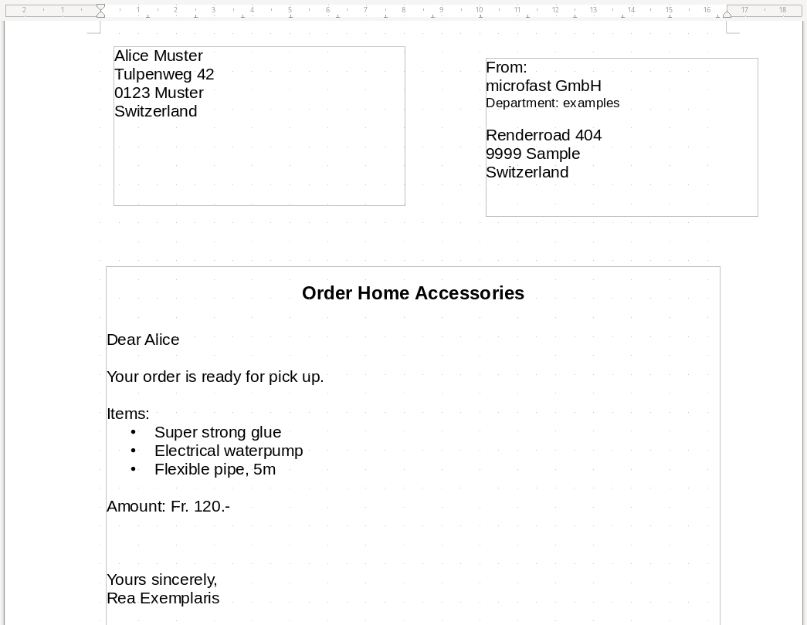

# rea
Rea is a document renderer that makes your document generation easy.
It can process [ODF](https://www.libreoffice.org/discover/what-is-opendocument/)
and [OOXML](https://support.microsoft.com/en-gb/office/open-xml-formats-and-file-name-extensions-5200d93c-3449-4380-8e11-31ef14555b18) files
and uses [Lua](https://www.lua.org/) as the templating language.

## Usage
Rea has two main functions:

- Templating: Filling out a document or template with data
- Rendering: Converting a document to a archivable format (e.g. PDF)

Usually you will have a template document that contains instructions on how data
is connected to the document structure. During the `template`-step you will bring
these two parts together to have a filled out document. This document you can
further edit or use the `render`-step to create a PDF from it.

### Templating
Rea uses Lua as it's templating language. This allows you to have a well known,
simple and convenient yet powerful processing engine.

It works by having your (template) document as is but introducing two text blocks
that have a special function:

- `[[ foo ]]`: This is a code block, everything between `[[` and `]]` is interpreted as lua code
- `[# bar #]`: This is a print block, everything between `[#` and `#]` is printed out into the document. It's a shorthand for calling `Print(bar)` in a code block.

Let's take this example document:


Here you see a usual ODF (or OOXML/docx) document that has different blocks inside.
The block `[# firstname #]` will print the value for the variable `firstname` to the document.

Later you find a bloc `[[ for i,v in iparis(order.items) do ]]` that will create a for-loop in
Lua that ranges over the `order.items` table and set the value to the variable `v`.
This variable can be printed using `[# v #]` so the values of `order.items` will be rendered
to a list.

But also other control structures, variables and Lua functions can be used, like the `[[ if epay then ]]`
block.

The model for this document can be described as a yaml file and looks like this:
```yaml
data:
  firstname: Alice
  lastname: Muster
  addr:
    street: Tulpenweg 42
    postal: "0123 Muster"
    country: Switzerland
  order:
    title: "Home Accessories"
    items:
    - Super strong glue
    - Electrical waterpump
    - Flexible pipe, 5m
    amount: "Fr. 120.-"
  epay: false
```

Now you can run rea with the following command to merge the template with the model:
```bash
rea template -t examples/letter.odt -m examples/letter.yaml -o my-document.odt
```

You will get a `my-document.odt` that looks like this:


*Note: Currently there is an issue and you will most likely get unwanted paragraphs/newlines
on the rendering result. We will surpress this and simplify the loop command too.*

#### Creating a template
As seen in the previous example, you can use Lua code between the `[[ foo ]]` blocks directly.
Everything is executed in the same scope unless you create scopes by yourself. This
allows you to assign and variables.

Emitting values to the document works solely with the `Print(foo)` function, that you
can also call using the special print block `[# foo #]`.

#### Passing data to the document
You can pass data to the template by having an input file as yaml. It should contain
two top level keys `data` and `metadata`, where you are free to define your data structure.
The `metadata` key is special as it will be used to set the documents metadata like author.

Example:
```yaml
metadata:
  author: "John Doe"
data:
  customer:
    firstname: "Sue"
    lastname: "Chang"
  items:
  - Apple
  - Banana
  - Lemon
  greeting: "Hello Sue!"
```

The fields from `data` can be accessed directly in your document (e.g. `[# customer.firstname #]`)
whereas `metadata` values needs to be accessed through the `metadata`-prefix (e.g. `[# metadata.author #]`).

#### Generate templated document
```plaintext
Process a template document to generate a filled out document

Usage:
  rea template [flags]

Flags:
  -b, --bundle string     tar file to which the job bundle should be written
  -d, --debug             write debug information to job bundle
  -h, --help              help for template
  -m, --model string      the model file (default "data.yaml")
  -o, --output string     output document (default "document.odt")
  -t, --template string   template document (default "template.ott"
```

We currently support ODF and OOXML text files.
For ODF files the input can be the text `.odf` or the template `.ott` format,
the result will be a `.odf` file in both cases.
For OOXML the input file needs to be a `.docx` and the output file will be a `.docx` aswell.

## Future work
As you may notice, this project is still in development. The following points
are nasty and will be improved soon:

- Creation of excessive linebreaks/paragraphs especially in loops will be mitigated
- The looping syntax will be simplified
- We will introduce some preprocessing macros (not the ones which you know from documents) to simplify syntax elements
