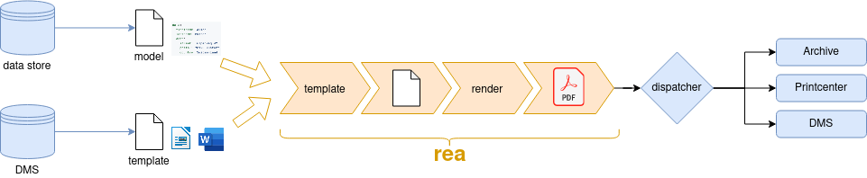

# Concepts

## Rea

## Templating pipeline
1. File Decomposing (e.g. loading content.xml)
2. Parsing XML as tree
3. Substituting, tokenizing and converting XML tree to Lua Prog
4. Executing Lua Prog to get node path (execution trace)
5. Node path regenerates XML and handles rebalancing
6. Document composing (e.g. repacking ODT file)
